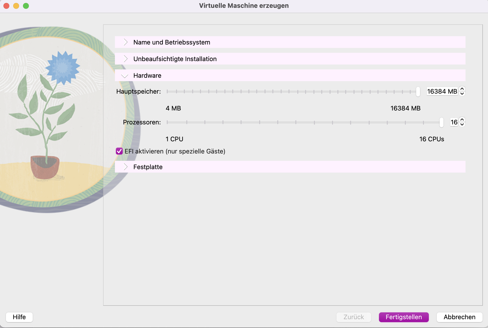

# Einführung in die Virtualisierung

## Lernziele
- Erste Schritte in der Virtualisierung verstehen.
- Die Grenzen der Virtualisierung kennenlernen.

---

## Hypervisor

Ein **Hypervisor**, auch bekannt als Virtual Machine Monitor (VMM), ist eine Software, Firmware oder Hardware, die die Erstellung und Verwaltung von virtuellen Maschinen (VMs) ermöglicht. Ein Hypervisor trennt das Betriebssystem und die Anwendungen von der physischen Hardware, um mehrere Betriebssysteme gleichzeitig auf derselben Hardware auszuführen.

---

## Typen von Hypervisoren

### Typ 1: Bare-Metal Hypervisor
- **Definition**: Läuft direkt auf der physischen Hardware und benötigt kein Basis-Betriebssystem.
- **Eigenschaften**:
  - Hohe Leistung, da keine Zwischenschicht vorhanden ist.
  - Wird häufig in Server-Umgebungen eingesetzt.
  - Beispiele: VMware ESXi, Microsoft Hyper-V, Xen.
- **Vorteil**: Direkter Zugriff auf die Hardware für eine bessere Effizienz und Sicherheit.

### Typ 2: Hosted Hypervisor
- **Definition**: Läuft auf einem bestehenden Betriebssystem und nutzt dessen Ressourcen.
- **Eigenschaften**:
  - Einfach einzurichten und zu verwenden.
  - Wird oft für Entwicklungs- und Testzwecke verwendet.
  - Beispiele: VMware Workstation, VirtualBox.
- **Nachteil**: Weniger effizient, da ein Betriebssystem als Zwischenschicht vorhanden ist.

---

## Unterschiede zwischen Typ 1 und Typ 2

| Merkmal                 | Typ 1 (Bare-Metal)         | Typ 2 (Hosted)            |
|-------------------------|----------------------------|---------------------------|
| **Installation**        | Direkt auf Hardware        | Auf einem OS installiert  |
| **Leistung**            | Höher                     | Geringer                  |
| **Einsatzgebiet**       | Rechenzentren, Server      | Lokale Systeme, Tests     |
| **Beispiele**           | VMware ESXi, Hyper-V      | VirtualBox, VMware Workstation |

---

## Praktische Anwendung: Virtualisierungssoftware (70%)

Für diesen Auftrag wurde ein **Apple MacBook mit M1 Pro** verwendet, und die Virtualisierungssoftware **VirtualBox** kam zum Einsatz.

### Vermutung: Hypervisor Typ
Da VirtualBox auf einem bereits installierten Betriebssystem (macOS) läuft, handelt es sich höchstwahrscheinlich um einen **Hypervisor Typ 2 (Hosted Hypervisor)**.

### Schritt-für-Schritt Dokumentation
1. **Ermittlung der Host-Ressourcen**:
   - Der MacBook M1 Pro verfügt über insgesamt 16 logische Prozessoren und 16 GB RAM.

2. **Erstellung einer virtuellen Maschine**:
   - Es wurde eine virtuelle Maschine mit dem Betriebssystem **Debian** erstellt.

3. **Ressourcenzuweisung an die VM FEHLER**:
   - Prozessoren: 16 CPUs wurden der VM zugewiesen.
   - RAM: Die VM erhielt 16 GB RAM. 
   
   - Der Maschine wurde im Endeffekt 3 CPUs und 2GB Ram hinzugefügt.

4. **Test der Zuweisungen**:
   - CPU: Beim Befehl `lscpu | grep "CPU(s)"` zeigt die VM die zugewiesenen 3 Prozessoren korrekt an ([Screenshot 3](Images/4.png)).
   - RAM: Die RAM-Zuweisung wird ebenfalls korrekt in der VM angezeigt ([Screenshot 4](Images/6.png)).

5. **Fehlermeldungen**:
   - VirtualBox zeigte eine Warnung zur **ungültigen Konfiguration** beim Versuch, mehr Ressourcen zuzuweisen, als auf dem Host verfügbar sind. Dies ist auf die Architektur des M1-Chips zurückzuführen und auf die Einschränkungen eines Typ-2-Hypervisors, wie in [Screenshot 5](Images/1.png) dokumentiert.

### Analyse und Schlussfolgerung
Die durchgeführten Tests bestätigten, dass es sich bei VirtualBox auf einem M1-Mac um einen **Hypervisor Typ 2** handelt. Ein Hosted Hypervisor kann nicht direkt auf die Hardware zugreifen und ist daher in der Ressourcenzuweisung eingeschränkt. Da VirtualBox auf macOS läuft, muss es sich auf die Ressourcenverwaltung des Host-OS verlassen. Dies führt dazu, dass die maximale Ressourcenzuweisung durch das Host-Betriebssystem limitiert wird, was die Beobachtungen erklärt.

---

**Autor**: [Tim]