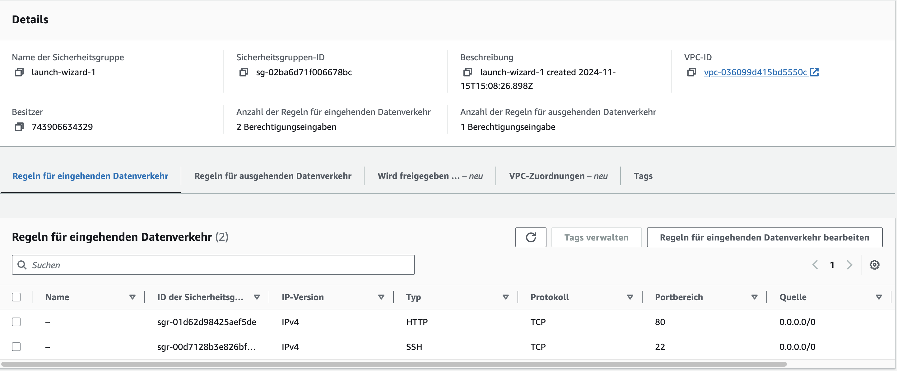
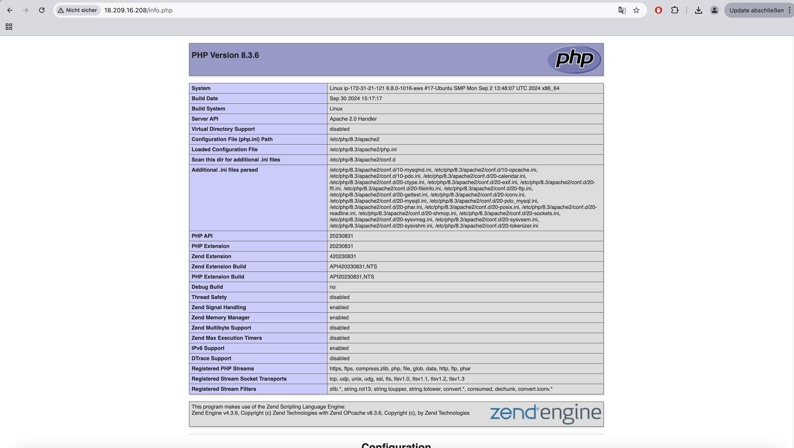
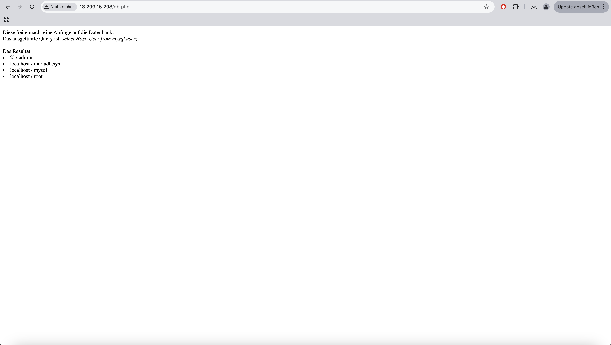
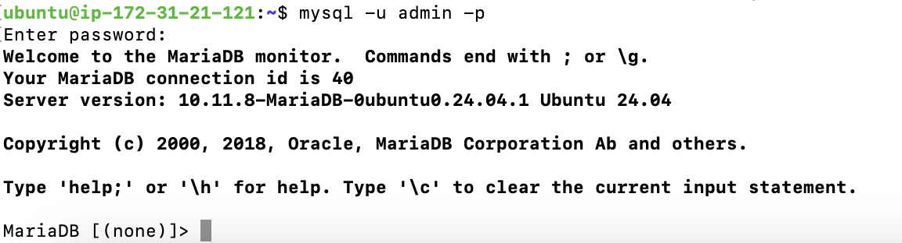

# KN03: IaaS - Virtuelle Server

## Lernziele
- Einstieg in die IAAS-Umgebung durch AWS und manuelle Installation auf einer Ubuntu-Instanz.
- Installation eines Web- und Datenbankservers sowie Konfiguration der nötigen Firewall-Einstellungen.
- Verwaltung von Sicherheitsgruppen und Nutzung von SSH sowie Web-Zugriff.

---

## Installation und Konfiguration

### Schritt A: Installation von Web- und Datenbankserver (60%)

1. **Systemaktualisierung und Installation der nötigen Pakete**
   ```bash
   sudo apt update
   sudo apt install apache2
   sudo apt install php
   sudo apt install libapache2-mod-php
   sudo apt install mariadb-server
   sudo apt install php-mysqli
   ```

2. **Erstellen eines neuen MySQL-Benutzers**
   ```bash
   sudo mysql -sfu root -e "GRANT ALL ON *.* TO 'admin'@'%' IDENTIFIED BY 'Ihr-Passwort' WITH GRANT OPTION;"
   ```
   *Hinweis: Ersetzen Sie 'Ihr-Passwort' durch ein sicheres Passwort.*

3. **Dienste neu starten**
   ```bash
   sudo systemctl restart mariadb.service
   sudo systemctl restart apache2
   ```

4. **Repository klonen und PHP-Dateien auf den Webserver kopieren**
   ```bash
   cd ~
   git clone https://gitlab.com/ch-tbz-it/Stud/m346/m346scripts.git
   sudo cp ./m346scripts/KN03/*.php /var/www/html/
   ```

---

### Schritt B: Konfiguration der Sicherheitsgruppe (Firewall)

- Anpassung der Sicherheitsgruppe der EC2-Instanz:
  - **Port 80** für HTTP-Zugriff auf den Webserver.
  - **Port 22** für SSH-Zugriff zur Verwaltung der Instanz.



---

### Schritt C: Überprüfung der Funktionalität

1. **Überprüfung der Apache-Installation**:
   - **URL**: `http://[Ihre-IP]/index.html`
   - Erfolgreicher Zugriff zeigt die Apache-Standardseite an.

   

2. **Überprüfung der PHP-Installation**:
   - **URL**: `http://[Ihre-IP]/info.php`
   - Zeigt PHP-Details an, was die korrekte Installation von PHP bestätigt.

   

3. **Überprüfung der Datenbankverbindung**:
   - **URL**: `http://[Ihre-IP]/db.php`
   - Listet die Datenbankbenutzer auf, was zeigt, dass die Datenbankverbindung funktioniert.

   

4. **MySql Login**:
   - Login in MySql Service

   