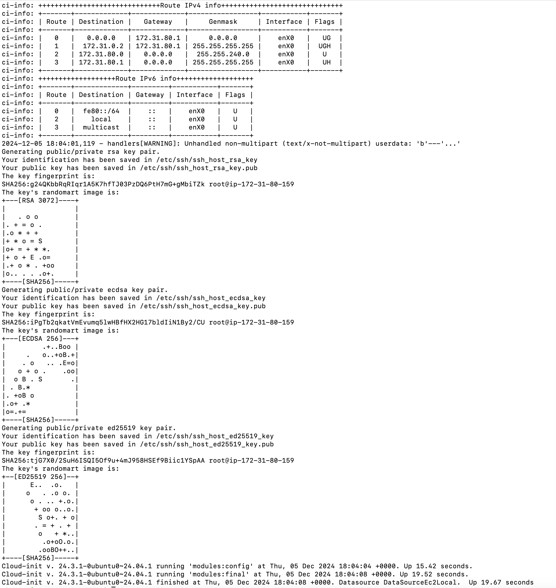
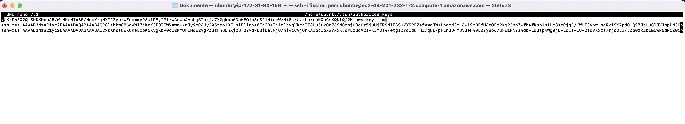
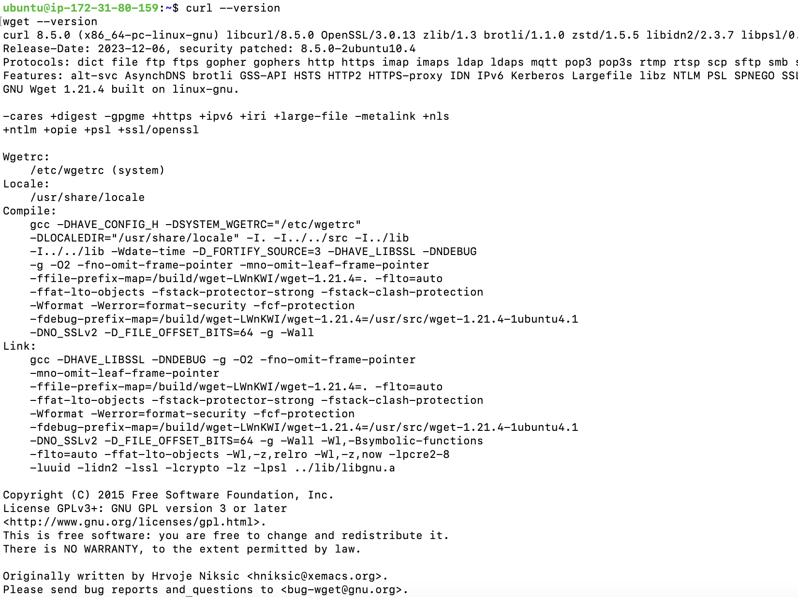
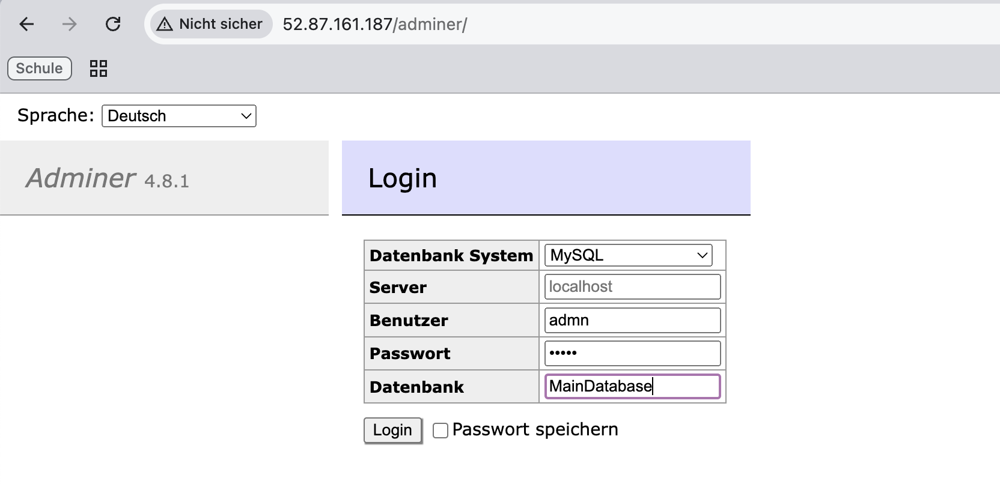
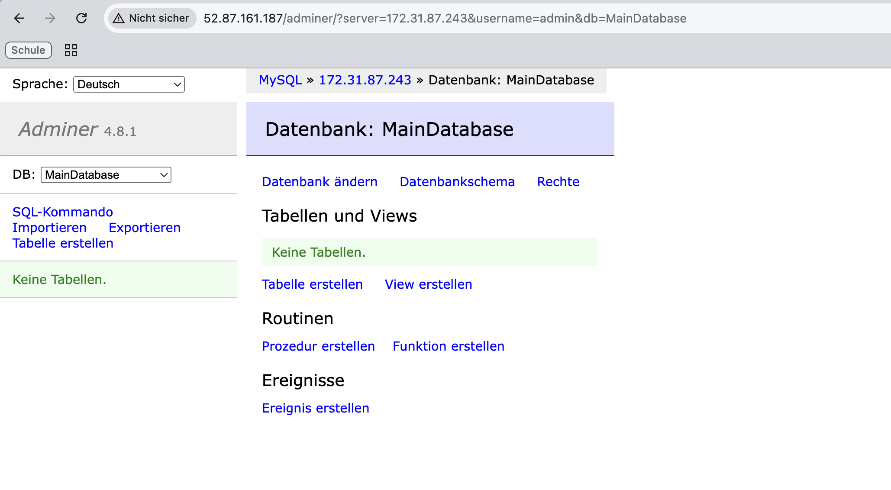

# Automatisierung und SSH-Key-Integration mit Cloud-Init

Dieses Dokument beschreibt die Schritte, die unternommen wurden, um SSH-Keys erfolgreich mit Cloud-Init zu integrieren und eine AWS-Instanz korrekt zu konfigurieren.

## Übersicht
Wir haben eine Cloud-Init-Datei verwendet, um eine Instanz zu konfigurieren. Diese Datei enthielt:
- Benutzererstellung
- SSH-Key-Integration
- Automatische Installation von Paketen

### Schritte im Detail

---

### **1. Cloud-Init-Datei erstellen**

Die Cloud-Init-Datei wurde wie folgt erstellt:

```yaml
---
users:
  - name: ubuntu
    sudo: ALL=(ALL) NOPASSWD:ALL
    groups: users, admin
    home: /home/ubuntu
    shell: /bin/bash
    ssh_authorized_keys:
      - ssh-rsa AAAAB3NzaC1yc2EAAAADAQABAAABAQDNR9R127WUjX8ldgJe+lJ8EuPKKySGkLbg2P5tIhmE7k6KoqF/C6MytbZ4/1APQcdkf0bZ/seIbOeTAaD3ahY1ELywbw34jycTo6LpkkxLHhwO5pGDkEfyUSmKGxFY7fRFeRhxcDGJZ2e1nGEt85PhBUdgx2OerB7gsIKzgONmQq6Qyy1H9JZZ0mzLmYK7IsusS/C6mj7eSBX/eZcCFUKzP6FQ2Q1SKKKNobA5/WiHKrHI4B5/MqpYrqHXIJZyprWZopmmyR8u1DByIPlzWAowbJAnbg5Tax/z7M2gkbb63oHEO1u8dSP1HiqmWzHi0k/UzzLakcbNQoCsXQKtQ/2H aws-key-tim
      - |
        -----BEGIN RSA PUBLIC KEY-----
        MIIBCgKCAQEA8lshkw886qvWI7jKrK3F0TIWVawmw/nJy9mC6Uy205Yto13F+piE
        llc6z0FhJBeTj1glbVqVKchII8Hu5uxOc76SNGxoj63c6z5juUjIRSNIESSuVXSR
        FZefVwqJW+Lnqod3ML6W19pDFfH6tOFmPkqPJhhZWfhAfknb1pIHc3XtCjqF/KWU
        I3v6w+hqRxfSY7pdO+Q9ZJpUuGlJVJhpDN3OmeY/6YS48k0Wsijg/3WckxFUhmWk
        vXLHd0Lv2/fKqB/Vabxu/q4vkTTIdyGJCKTkSY4ZQscb2+rk0fPVnLzU/eJDQQNB
        lBAkJILhJS48fVkkdEcIpnzr+G/hMI/7FwIDAQAB
        -----END RSA PUBLIC KEY-----  # Öffentlicher Schlüssel der Lehrperson
ssh_pwauth: false
disable_root: true
package_update: true
package_upgrade: true
packages:
  - curl
  - wget
runcmd:
  - echo "Cloud-Init erfolgreich ausgeführt!"
  - echo "Benutzer: ubuntu" > /home/ubuntu/init.log
```

---

### **2. Cloud-Init in AWS-Instanz hochladen**

1. AWS Management Console öffnen.
2. Eine neue EC2-Instanz erstellen und die Cloud-Init-Datei in der Sektion **"Advanced Details" > "User data"** hochladen.
3. Eine Sicherheitsgruppe hinzufügen, die SSH-Zugriff erlaubt.

---

### **3. Verbindung zur Instanz herstellen**

#### Mit dem GUI-SSH-Key:
```bash
ssh -i "fischer.pem" ubuntu@<instance-ip>
```
**Erfolg:** Verbindung hergestellt.

#### Mit dem Cloud-Init-SSH-Key:
```bash
ssh -i "tim.pem" ubuntu@<instance-ip>
```
**Erfolg:** Verbindung hergestellt.

---

### **4. Fehlerbehebung und Logs**

Falls die Verbindung fehlschlägt, prüfe die Logs:
```bash
cat /var/log/cloud-init-output.log
```

Screenshot des Logs:


---

### **5. Manuelle Anpassungen**

Falls der Schlüssel nicht korrekt übernommen wird:
1. Verbinde dich mit dem GUI-SSH-Key.
2. Bearbeite die Datei `~/.ssh/authorized_keys`:
```bash
nano ~/.ssh/authorized_keys
```
3. Füge die öffentlichen Schlüssel hinzu.

Screenshot der `authorized_keys`:


---

### **6. Überprüfung**

**Schritte zur Überprüfung:**
- Teste den Zugriff mit beiden privaten Schlüsseln.
- Verifiziere die Pakete:
```bash
curl --version
wget --version
```

Screenshot der SSH-Verbindung:


---

### **Ergebnis**

- Die Konfiguration wurde erfolgreich durchgeführt.
- Beide SSH-Schlüssel funktionieren und die Instanz ist korrekt eingerichtet.

---

## Screenshots

### Cloud-Init Logs


### `authorized_keys` Datei


### Erfolgreicher SSH-Zugriff


---


# KN04: Datenbank und Webserver Konfiguration

## Überblick
Dieses Projekt beinhaltet die Konfiguration und den Test einer MySQL-Datenbank sowie eines Webservers in AWS. Beide Server wurden in einem gemeinsamen VPC-Netzwerk bereitgestellt, um sichere und direkte Verbindungen zu gewährleisten.

---

## Schritte zur Überprüfung der MySQL-Verbindung

### 1. Verbindung zur Datenbank vom Webserver aus testen
Mit folgendem Befehl kann die Verbindung zur Datenbank geprüft werden:
```bash
mysql -u admin -p -h 172.31.87.243
```
Wenn die Verbindung erfolgreich ist, wird der MySQL-Monitor geöffnet:
```plaintext
Welcome to the MySQL monitor.  Commands end with ; or \g.
Your MySQL connection id is 32
Server version: 5.5.5-10.11.8-MariaDB-0ubuntu0.24.04.1 Ubuntu 24.04
```

### 2. Verbindung mit `nc` testen
```bash
nc -zv 172.31.87.243 3306
```
Ausgabe:
```plaintext
Connection to 172.31.87.243 3306 port [tcp/mysql] succeeded!
```

---

## PHP-Skript zur Datenbankverbindung
Ein PHP-Skript wurde erstellt, um die Verbindung von der Webserver-Seite zu testen.

### Beispielcode:
```php
<?php
$servername = "172.31.87.243";
$username = "admin";
$password = "admin";
$dbname = "MainDatabase";

$conn = new mysqli($servername, $username, $password, $dbname);

if ($conn->connect_error) {
    die("Connection failed: " . $conn->connect_error);
}
echo "Connected successfully to the database.";
?>
```

### Testausgabe:
Der folgende Screenshot zeigt das Ergebnis, wenn das PHP-Skript ausgeführt wird.


---

## Netzwerkregeln (AWS Sicherheitsgruppen)

### Eingehender Datenverkehr
- **Port 3306**: Zugriff für MySQL von überall (`0.0.0.0/0`).
- **Port 22**: SSH-Zugriff von überall (`0.0.0.0/0`).


### Ausgehender Datenverkehr
- **Alle Ports**: Vollständiger Zugriff für ausgehenden Datenverkehr.


---

## Status der Dienste
### MySQL-Dienst auf der Datenbankinstanz
```bash
sudo systemctl status mysql
```
Ausgabe:
```plaintext
● mariadb.service - MariaDB 10.11.8 database server
     Loaded: loaded (/usr/lib/systemd/system/mariadb.service; enabled; preset: >
     Active: active (running) since Fri 2024-12-06 10:05:20 UTC; 1min 13s ago
```


### UFW-Status
Die Firewall (`ufw`) ist auf der Datenbankinstanz deaktiviert:
```bash
sudo ufw status
```
Ausgabe:
```plaintext
Status: inactive
```

---

## Screenshots
1. **Datenbank-Verbindung erfolgreich:**
   
2. **Netcat-Test erfolgreich:**
   


## Adminer
1. **Adminer-Verbindung erfolgreich:**
   
2. **Adminer-DB Connect erfolgreich:**
   
---

## Hinweise
- Alle Instanzen befinden sich im gleichen VPC und Subnetz, um eine direkte Verbindung zu gewährleisten.
- Die MySQL-Datenbank ist so konfiguriert, dass sie Verbindungen von der privaten IP des Webservers akzeptiert.
