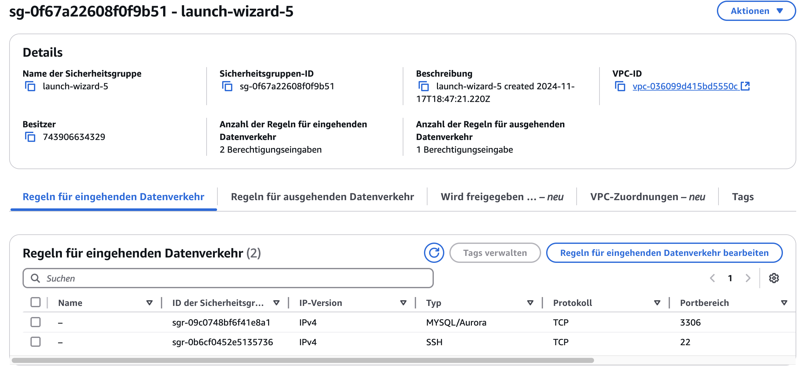
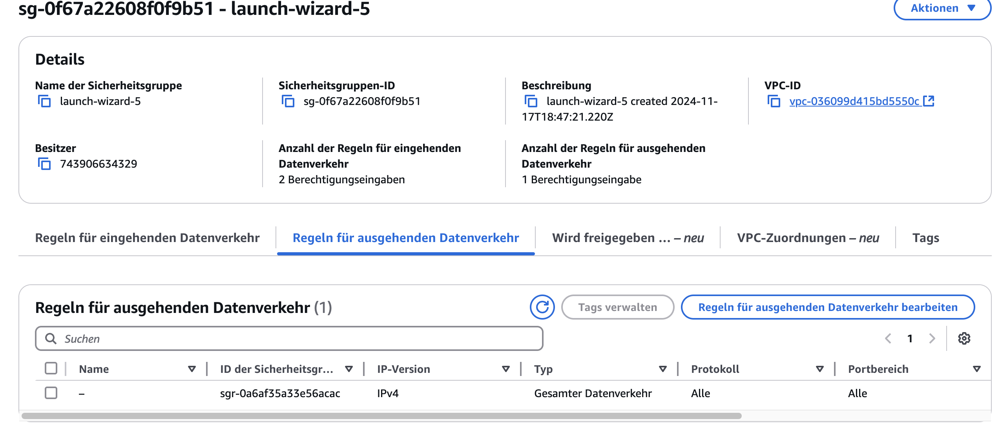
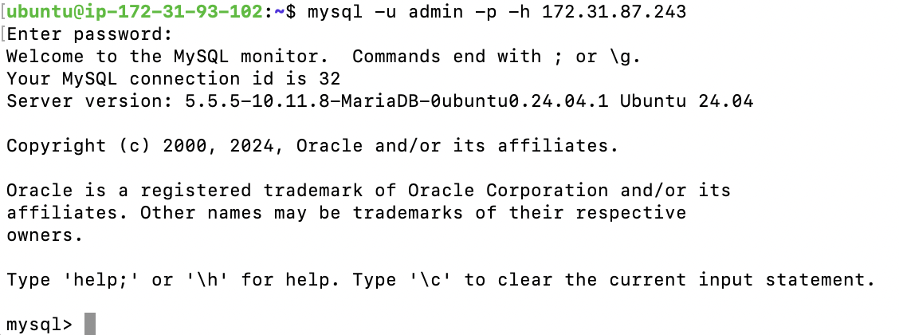

# KN04: Datenbank und Webserver Konfiguration

## Überblick
Dieses Projekt beinhaltet die Konfiguration und den Test einer MySQL-Datenbank sowie eines Webservers in AWS. Beide Server wurden in einem gemeinsamen VPC-Netzwerk bereitgestellt, um sichere und direkte Verbindungen zu gewährleisten.

---

## Schritte zur Überprüfung der MySQL-Verbindung

### 1. Verbindung zur Datenbank vom Webserver aus testen
Mit folgendem Befehl kann die Verbindung zur Datenbank geprüft werden:
```bash
mysql -u admin -p -h 172.31.87.243
```
Wenn die Verbindung erfolgreich ist, wird der MySQL-Monitor geöffnet:
```plaintext
Welcome to the MySQL monitor.  Commands end with ; or \g.
Your MySQL connection id is 32
Server version: 5.5.5-10.11.8-MariaDB-0ubuntu0.24.04.1 Ubuntu 24.04
```

### 2. Verbindung mit `nc` testen
```bash
nc -zv 172.31.87.243 3306
```
Ausgabe:
```plaintext
Connection to 172.31.87.243 3306 port [tcp/mysql] succeeded!
```

---

## PHP-Skript zur Datenbankverbindung
Ein PHP-Skript wurde erstellt, um die Verbindung von der Webserver-Seite zu testen.

### Beispielcode:
```php
<?php
$servername = "172.31.87.243";
$username = "admin";
$password = "admin";
$dbname = "MainDatabase";

$conn = new mysqli($servername, $username, $password, $dbname);

if ($conn->connect_error) {
    die("Connection failed: " . $conn->connect_error);
}
echo "Connected successfully to the database.";
?>
```

### Testausgabe:
Der folgende Screenshot zeigt das Ergebnis, wenn das PHP-Skript ausgeführt wird.


---

## Netzwerkregeln (AWS Sicherheitsgruppen)

### Eingehender Datenverkehr
- **Port 3306**: Zugriff für MySQL von überall (`0.0.0.0/0`).
- **Port 22**: SSH-Zugriff von überall (`0.0.0.0/0`).



### Ausgehender Datenverkehr
- **Alle Ports**: Vollständiger Zugriff für ausgehenden Datenverkehr.



---

## Status der Dienste
### MySQL-Dienst auf der Datenbankinstanz
```bash
sudo systemctl status mysql
```
Ausgabe:
```plaintext
● mariadb.service - MariaDB 10.11.8 database server
     Loaded: loaded (/usr/lib/systemd/system/mariadb.service; enabled; preset: >
     Active: active (running) since Fri 2024-12-06 10:05:20 UTC; 1min 13s ago
```


### UFW-Status
Die Firewall (`ufw`) ist auf der Datenbankinstanz deaktiviert:
```bash
sudo ufw status
```
Ausgabe:
```plaintext
Status: inactive
```

---

## Screenshots
1. **Datenbank-Verbindung erfolgreich:**
   
2. **Netcat-Test erfolgreich:**
   

---

## Hinweise
- Alle Instanzen befinden sich im gleichen VPC und Subnetz, um eine direkte Verbindung zu gewährleisten.
- Die MySQL-Datenbank ist so konfiguriert, dass sie Verbindungen von der privaten IP des Webservers akzeptiert.
