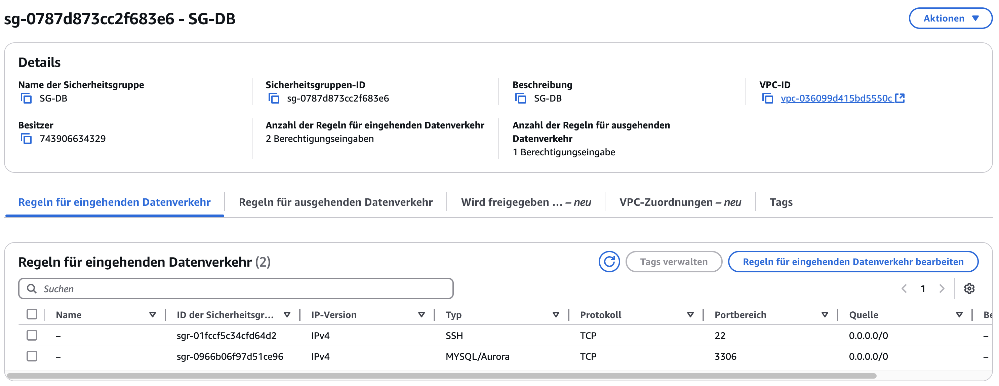
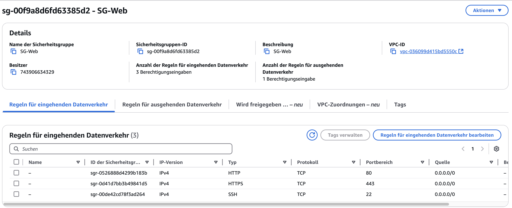
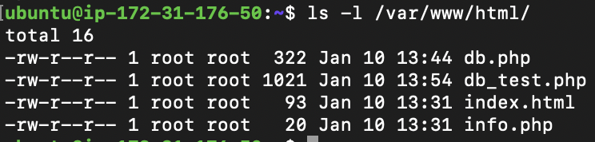
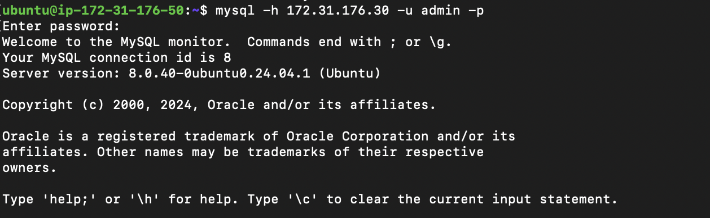
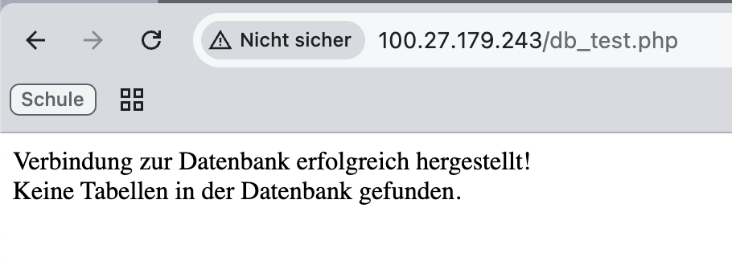

# KN05: Netzwerk und Sicherheit – Web- und Datenbankserver

## **Projektziel**
- Einrichtung eines Webservers und eines separaten Datenbankservers auf AWS.
- Verbindung zwischen Webserver und Datenbankserver testen.
- Sicherheitsgruppen, private IPs und Subnetzkonfigurationen dokumentieren.

---

## **1. Grundlegende Einrichtung**

### **1.1 Subnetz und private IP-Adressen**
- **Webserver:** `172.31.176.50`  
- **Datenbankserver:** `172.31.176.30`

Beide Instanzen wurden im Subnetz `172.31.176.0/20` erstellt. Die private IPs wurden manuell zugewiesen, um sicherzustellen, dass sie konstant bleiben.

---

## **2. Sicherheitsgruppen**
### **2.1 Sicherheitsgruppe für den Webserver**
- **Eingehende Regeln:**
  - **HTTP (Port 80):** Zugriff von überall (0.0.0.0/0).
  - **HTTPS (Port 443):** Zugriff von überall (0.0.0.0/0).
  
- **Screenshot der Inbound-Regeln:**
  

### **2.2 Sicherheitsgruppe für den Datenbankserver**
- **Eingehende Regeln:**
  - **MySQL (Port 3306):** Zugriff nur von der privaten IP des Webservers (`172.31.176.50/32`).

- **Screenshot der Inbound-Regeln:**
  

---

## **3. Cloud-init-Konfiguration**

### **3.1 Webserver**
- **Paketinstallation:**
  - Apache2, PHP, Adminer.
- **Erstellte Dateien:**
  - `index.html`: Webserver-Testseite.
  - `info.php`: PHP-Info-Seite.
  - `db.php`: Testverbindung zur Datenbank.

**Screenshot der Webserver-Dateien:**


### **3.2 Datenbankserver**
- **Paketinstallation:**
  - MySQL-Server.
- **Datenbank- und Benutzererstellung:**
  - Datenbank `MainDatabase`.
  - Benutzer `admin` mit Vollzugriff.

---

## **4. Verbindungen testen**

### **4.1 Verbindung zwischen Webserver und Datenbank**
- **Erfolgreiche Verbindung:**
  Die Verbindung vom Webserver zur Datenbank (`172.31.176.30`) wurde erfolgreich getestet.
  - **Befehl:**
    ```bash
    mysql -h 172.31.176.30 -u admin -p
    ```
  - **Screenshot der erfolgreichen Verbindung:**
    


---

## **5. Dateien auf dem Webserver**

### **5.1 `db_test.php`**
**Inhalt der Datei `db_test.php`:**
```php
<?php
$servername = "172.31.176.30";
$username = "admin";
$password = "admin";
$dbname = "MainDatabase";

$conn = new mysqli($servername, $username, $password, $dbname);

if ($conn->connect_error) {
    die("Verbindung zur Datenbank fehlgeschlagen: " . $conn->connect_error);
}
echo "Verbindung zur Datenbank erfolgreich hergestellt!";
?>
```
---

## **6. Ergebnis**
- Webserver und Datenbankserver wurden erfolgreich eingerichtet.
- Verbindung zwischen Webserver und Datenbankserver getestet und bestätigt.
- Sicherheitsrichtlinien wurden korrekt implementiert.

**Screenshot der erfolgreichen Verbindung im Browser:**


---

## **Anmerkungen**
- Weitere Verbesserungen könnten die Implementierung von HTTPS für Adminer und eine zusätzliche Firewall-Konfiguration umfassen.
- Logs wurden überprüft, und keine weiteren Fehler wurden festgestellt.
