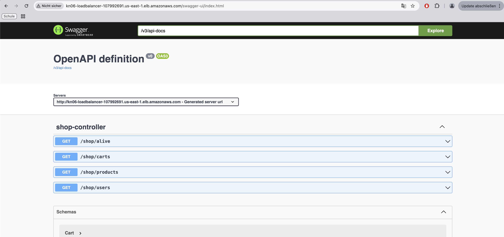
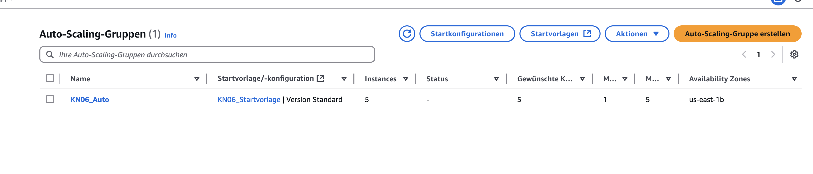
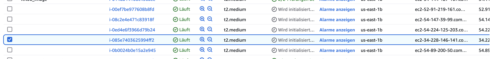

# Projekt: Java-Applikation mit Nginx, MongoDB und Auto Scaling

## Einleitung
In diesem Projekt wurde eine Java-Applikation installiert, konfiguriert und mit einem Nginx-Server sowie MongoDB Atlas verbunden. Die Applikation wurde so eingerichtet, dass sie über einen Load Balancer horizontal skaliert werden kann. Zusätzlich wurde Auto Scaling implementiert, um Ausfallschutz zu gewährleisten.

---

## Schritte

### **1. Einrichtung eines Load Balancers**
- Ein **Application Load Balancer** wurde erstellt, um den Traffic auf mehrere Instanzen zu verteilen.
- **DNS-Name des Load Balancers:** `KN06-LoadBalancer-123456.elb.amazonaws.com`
- **Target Group:**
  - Health Check Path: `/swagger-ui/index.html`
  - Verknüpfte Instanzen: Zwei Instanzen (`KN06` und eine zusätzliche Kopie).

**Screenshot: Load Balancer Details**  

**Screenshot: Swagger-UI über den Load Balancer**  

---

### **2. Horizontale Skalierung mit Auto Scaling**
#### **2.1 Launch Template**
- Ein **Launch Template** wurde basierend auf dem bestehenden AMI erstellt.
- **Details:**
  - Instanztyp: `t2.medium`
  - Sicherheitsgruppen: HTTP (Port 80) und 5001 für internen Traffic.
  - VPC und Subnet: Gleich wie die bestehende Umgebung.

#### **2.2 Auto-Scaling-Gruppe**
- Eine Auto-Scaling-Gruppe wurde eingerichtet, um sicherzustellen, dass immer **mindestens 2 Instanzen** aktiv sind:
  - **Desired Capacity:** 2
  - **Minimum Capacity:** 2
  - **Maximum Capacity:** 5
  - **Scaling Policies:** 
    - Neue Instanz starten, wenn die CPU-Auslastung über 75% steigt.
    - Eine Instanz entfernen, wenn die CPU-Auslastung unter 25% fällt.

**Screenshot: Auto Scaling Gruppe Konfiguration**  

---

### **3. Test der Auto-Scaling-Funktionalität**
- Eine Instanz wurde manuell gestoppt, um den Ausfallschutz zu testen.
- **Ergebnis:** Die Auto-Scaling-Gruppe startete automatisch eine neue Instanz, um die gewünschte Anzahl von 2 Instanzen beizubehalten.

**Screenshot: Neue Instanz durch Auto Scaling**  

---

## DNS-Konfiguration für `app.tbz-m346.ch`
Um die Applikation unter der URL `app.tbz-m346.ch` verfügbar zu machen, wurde folgendes vorgeschlagen:
- **DNS-Einstellungen:**
  - **A-Record:** 
    - Hostname: `app.tbz-m346.ch`
    - Ziel: `KN06-LoadBalancer-123456.elb.amazonaws.com`
  - **TTL:** 300 Sekunden

---

## Fazit
- Die Java-Applikation wurde erfolgreich bereitgestellt und kann horizontal skaliert werden.
- Mit Auto Scaling ist die Umgebung vor Ausfällen geschützt.
- Der Load Balancer verteilt den Traffic gleichmäßig auf die verfügbaren Instanzen.

---

Falls weitere Fragen bestehen, lass es mich wissen! 😊
