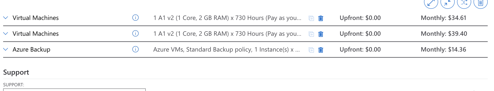
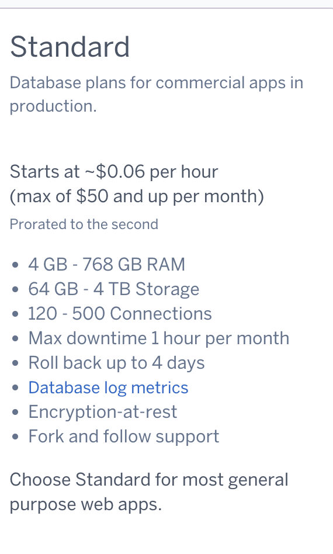
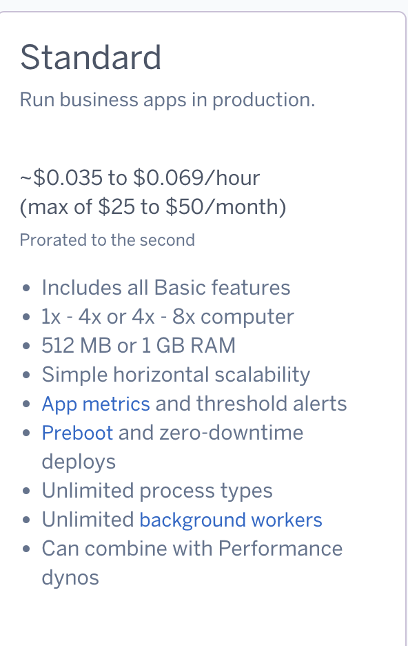
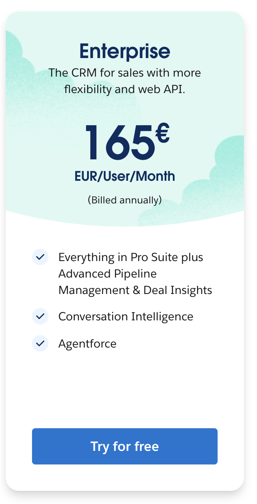
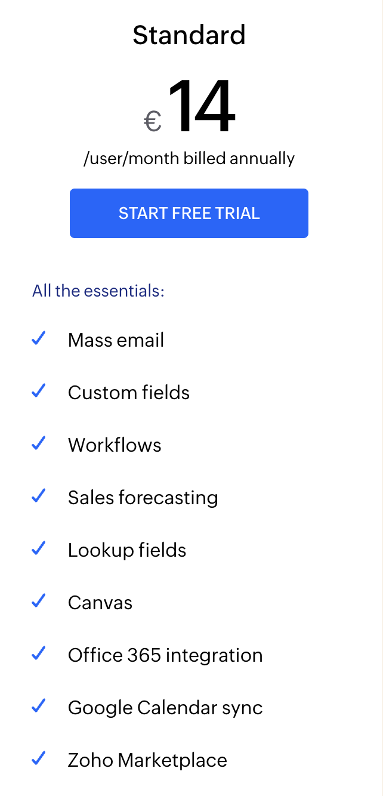

# README

## Screenshots

Die folgenden Screenshots dokumentieren die Kostenberechnungen für die verschiedenen Modelle und Anbieter.

### IAAS: Azure

### PAAS: Heroku (Datenbank)

### PAAS: Heroku (Webserver)

### SAAS: Salesforce

### SAAS: Zoho CRM

## Erklärung der Auswahl

### IAAS: Azure
- **Webserver:** Konfiguriert mit 1 Core, 2GB RAM.
- **Datenbankserver:** Konfiguriert mit 2 Cores, 4GB RAM, 100GB Speicher.
- **Backup:** Azure Backup mit Standardrichtlinie konfiguriert. Dies deckt tägliche, wöchentliche und monatliche Backups ab.

### PAAS: Heroku
- **Datenbank:** Standard-Datenbankplan, um die Spezifikationen von 4GB RAM und 100GB Speicher abzudecken.
- **Webserver:** Standard-Dyno mit 1GB RAM, ausreichender Performance für 30 Benutzer.

### SAAS: Salesforce und Zoho CRM
- **Salesforce:** Enterprise-Plan, da er erweiterte Funktionen wie Conversation Intelligence und Pipeline Management bietet, die für die Firma nützlich sind.
- **Zoho CRM:** Standard-Plan, der grundlegende CRM-Funktionen abdeckt und kosteneffizient ist.

## Kostenvergleich

| Anbieter/Modell     | Kosten pro Monat | Beschreibung                          |
|---------------------|-----------------|--------------------------------------|
| **Azure (IAAS)**    | \$88.37         | Virtual Machines und Backup.         |
| **Heroku (PAAS)**   | \$100 (geschätzt) | Webserver und Datenbank.             |
| **Salesforce (SAAS)** | €165/Benutzer  | 30 Benutzer, Enterprise-Plan.        |
| **Zoho CRM (SAAS)** | €14/Benutzer    | 30 Benutzer, Standard-Plan.          |

## Interpretation

### Kosten
- Die SAAS-Optionen (Salesforce, Zoho CRM) haben höhere Benutzerlizenzkosten, während IAAS und PAAS Kosten nach Nutzung berechnen.
- PAAS (Heroku) bietet gute Skalierbarkeit, ist jedoch teurer als IAAS (Azure).

### Aufwand
- **IAAS:** Erfordert die Verwaltung von Servern, Betriebssystemen und Backups.
- **PAAS:** Reduziert den Verwaltungsaufwand erheblich, da Heroku viele DevOps-Aufgaben automatisiert.
- **SAAS:** Minimale Verwaltung, da die Anbieter die gesamte Infrastruktur und Software bereitstellen.

## Empfehlung
- **Wenn geringe Kosten im Vordergrund stehen:** Azure (IAAS) oder Zoho CRM.
- **Wenn geringerer Aufwand priorisiert wird:** Heroku (PAAS) oder Salesforce (SAAS).
